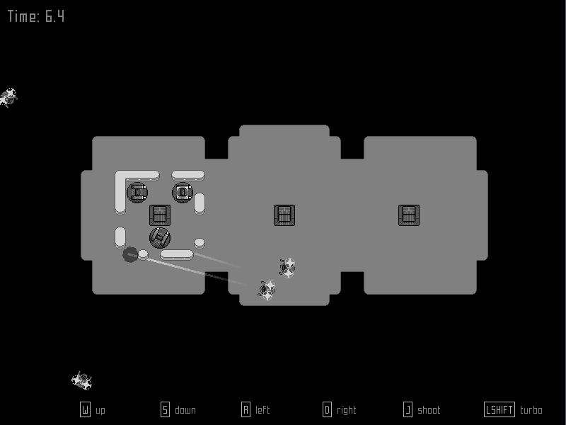

Damage Control
===

Damage Control is a game similar to
[Rampart](https://en.wikipedia.org/wiki/Rampart_(video_game)).

The source code is released under the
[MIT License](http://opensource.org/licenses/MIT)

The music, sounds, and art are available under
[CC-BY-SA 3.0](http://creativecommons.org/licenses/by-sa/3.0/).

The font used is
[Mecha by Captain Falcon](http://www.fontspace.com/captain-falcon/mecha)

# Give it a try!

## Pre-built
Just grab the most recent
[release](https://github.com/rcorre/damage_control/releases) for your platorm,
unpack it, and run the `damage_control` executable.

The linux binaries are statically linked to Allegro5, but other dependencies are
dynamically linked. The Windows binaries just come packaged with a bunch of .dll
files.

## Build it yourself
You will need a [D compiler](http://dlang.org/download.html) and
[dub](http://code.dlang.org) to compile the game,
[aseprite](http://www.aseprite.org/) to generate the images, and
[lmms](https://lmms.io/) to compile the music. You must use a recent version of
LMMS (one which supports `--loop`, which is not in the current release).

Running `make` should do the trick. This will invoke `dub` to compile the code,
`aseprite` to export `.ase` files to `.png`, and `lmms` to export `.mmpz` files
to `.ogg`. You can usually ignore complaints that `lmms` failed to export a
file. This is a [known bug](https://github.com/LMMS/lmms/issues/588) where
`lmms` will segfault at the end of rendering but still produce the output file.

## Static Linkage
To link statically to Allegro, invoke `make debug-static` or
`make release-static`.
Make sure you run `git submodule update --init` first to get the allegro
sources.

# How to play

At the start of a match, you get to pick one of several starting locations. 
Now you just need to survive for a few rounds. Each round, you will:

1. Place turrets within your territory
2. Fend off enemies, taking them down with your turrets
3. Place walls to repair the damage done

If, at the end of a round, you have no territory, you are defeated. Territory is
defined as an area completely enclosed by walls. The more territory you enclose,
the more turrets you can place. Each turret has limited ammo -- at the end of
each round, you gain 6 ammo for each base you have enclosed (bases are the
squarish things on the map).

Don't forget that you can use Q/E (default) to rotate blocks and hold shift
(default) to move the cursor faster .

# Credits:

- Written in [D](http://dlang.org).
- Using the [Allegro](https://allegro.cc/) game library.
- Pixel art created with [Aseprite](http://aseprite.org).
- Music created with [LMMS](https://lmms.io).
- Maps created with [Tiled](http://mapeditor.org).
- Sounds processed with [Audacity](http://www.audacityteam.org/).
- Font: [Mecha by Captain Falcon](http://www.fontspace.com/captain-falcon/mecha)
- Some sounds were generated with [bxfr](http://www.bfxr.net/).
- Other sounds are just various recordings I took.
